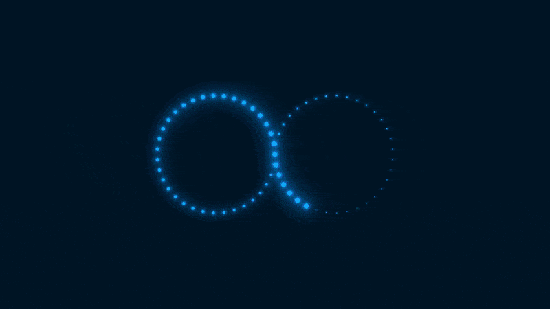
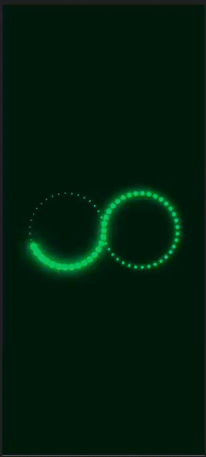

# Infinity-CSS
Animação do símbolo de infinito usando apenas HTML e CSS.
O projeto consiste em criar um efeito de luz percorrendo o símbolo de infinito.
Foquei em tentar deixar o projeto o mais dinâmico possível, tanto no quesito responsividade como de ajustes de cor, tamanhos e velocidade.

Para ver o projeto em execução acesse: https://lucianobwille.github.io/Infinity-CSS/

## Desktop Preview
</img>

## Mobile Previw
</img>